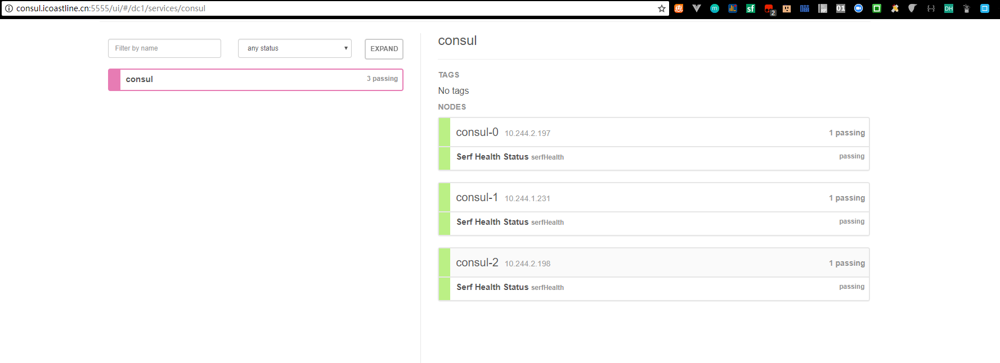

# 在kubernetes上运行consul 集群


本教程将帮助你在kubernetes上部署一个拥有3个节点的consul集群 备注：consul教程见[Consul](https://www.consul.io)

## 预览

* consul 集群的三个节点部署方式使用 [StatefulSet](http://kubernetes.io/docs/concepts/abstractions/controllers/statefulsets)
* consul集群成员之间的信息交换安全模式使用 [TLS and encryption keys](https://www.consul.io/docs/agent/encryption.html)

## 预备知识

本教程利用了Kubernetes 1.7.0和更高版本的特性.

* [kubernetes](http://kubernetes.io/docs/getting-started-guides/binary_release) 1.7.x

下客户端必须安装在本教程所使用的机器上:

* [consul](https://www.consul.io/downloads.html) 0.9.x
* [cfssl](https://pkg.cfssl.org) and [cfssljson](https://pkg.cfssl.org) 1.2

## 使用

Clone this repo:

```
git clone https://github.com/nicklv/consul_cluster_on_kubernetes.git
```

进入到 `consul-on-kubernetes` 目录:

```
cd consul-on-kubernetes
```

### 生成 TLS 证书


Consul集群中成员之间的RPC通信使用TLS进行加密。通过一下命令初始化CA证书：
```
cfssl gencert -initca ca/ca-csr.json | cfssljson -bare ca
```

使用以下命令创建 TLS 证书 和 私有密钥:

```
cfssl gencert \
  -ca=ca.pem \
  -ca-key=ca-key.pem \
  -config=ca/ca-config.json \
  -profile=default \
  ca/consul-csr.json | cfssljson -bare consul
```

执行完以上命令之后，在当前目录你应该看到以下证书文件:

```
ca-key.pem
ca.pem
consul-key.pem
consul.pem
```

### 生成 Consul Gossip 加密密钥

[Gossip communication](https://www.consul.io/docs/internals/gossip.html) Consul 集群成员之间使用共享的加密密钥进行加密通信。使用以下命令生成加密密钥:
```
GOSSIP_ENCRYPTION_KEY=$(consul keygen)
```

### 使用以下命令生成Consul 集群使用的Secret 和 Configmap

Consul集群将通过CLI标志、TLS证书和配置文件来完成配置，这些内容通过Kubernetes的configmaps和secrets来存储。

将 gossip 加密密钥 和 TLS 证书 存储在kubernetes的 Secret中:

```
kubectl create secret generic consul \
  --from-literal="gossip-encryption-key=${GOSSIP_ENCRYPTION_KEY}" \
  --from-file=ca.pem \
  --from-file=consul.pem \
  --from-file=consul-key.pem
```

将Consul集群使用的配置文件存储在kubernetes的 ConfigMap中:

```
kubectl create configmap consul --from-file=configs/server.json
```
### 在创建Consul service和statefulSet之前，先创建Consul集群使用到的pv(persistVolume)持久化存储卷和pvc(persistVolumeClaim)持久化存储卷声明
```
kubectl create -f pvc/pvc.yaml 
```
### 通过kubectl 命令创建Consul 集群服务

通过创建一个service来暴露Consul 集群功能：
```
kubectl create -f services/consul.yaml
```

### 创建 Consul 集群 StatefulSet

通过部署StatefulSet(有状态副本集)来启动Consul集群的3个实例节点：
```
kubectl create -f statefulsets/consul.yaml
```


所有的Consul节点都会被创建，在进入下一步操作之前，先验证所有的节点都处在正常的 `Running` 状态,执行以下命令可以看到如下结果：
```
kubectl get pods
```

```
NAME       READY     STATUS    RESTARTS   AGE
consul-0   1/1       Running   0          50s
consul-1   1/1       Running   0          29s
consul-2   1/1       Running   0          15s
```

### 核实节点状态

在这个环节，Consule 集群的所有节点都已经启动。为了确定每个节点都已经正常的工作，可以通过查看日志的命令，查看每个集群的成员状态。
```
kubectl logs consul-0
```

(这一步可不执行)可以使用Consul CLI检查consul集群的健康状态，可以在新的命令窗口使用port-forward模式来通过IP访问，在本教程的中我们的测试环境申请了域名，通过花生壳支持外网访问。

```
kubectl port-forward consul-0 8400:8400
```
```
Forwarding from 127.0.0.1:8400 -> 8400
Forwarding from [::1]:8400 -> 8400
```
`(如果不执行上一步命令，可以通过以下命令进入到consul-0 pod，kubectl exec -it consul-0 /bin/sh)`
执行`consul members`命令查看consul集群所有节点的状态。

```
consul members
```

```
Node      Address           Status  Type    Build  Protocol  DC
consul-0  10.244.2.197:8301  alive   server  0.9.1  2        dc1
consul-1  10.244.1.231:8301  alive   server  0.9.1  2        dc1
consul-2  10.244.2.198:8301  alive   server  0.9.1  2        dc1
```

### 访问consul 集群Web UI

目前Consul集群的UI站点不支持权限验证，所以为了安全起见不建议在生产环境把Web UI访问暴露到外网。访问Web-UI有两种访问方式：
1. 通过port-forward把consul-0节点的8500端口暴露出来，这种方式类似nodeport模式，所有访问consul-0节点所在服务器8500端口的流量都被转发到consul-0。弊端，节点重启之后所在服务器节点发生变化的话访问IP也跟着变化。建议在实验环境使用这种模式。

```
kubectl port-forward consul-0 8500:8500
```

	执行以上命令之后，通过URL地址 http://127.0.0.1:8500访问consul集群web管理界面。
2. 通过Ingress暴露外网访问，我们配置了一个consul.xxxx.cn的域名，暴露到了外网。这种模式，外网可以无限制进行consul集群web管理界面访问，所以建议在开发或者测试环境使用，不要在生产环境使用该模式。


 



## 清理

运行`cleanup`脚本，会自动清除掉所有正在运行的consul相关的kubernetes资源。备注：根据实际情况调整下	`cleanup`脚本。
```
bash cleanup
```
